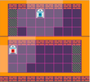
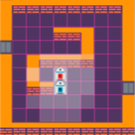
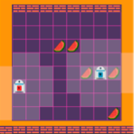

# 🦩🌴 MARL-Neon-Grid

A collection of multi-agent reinforcement learning gridworlds to study coordination and cooperation that follows the 
[Gymnasium](https://github.com/Farama-Foundation/Gymnasium) interface. 
All agents are equipped with a 360 degree sensor to obtain a partial view of the world. 
We use [ray casting](https://en.wikipedia.org/wiki/Ray_casting) and [bresenham's algorithm](https://en.wikipedia.org/wiki/Bresenham%27s_line_algorithm) to determine what the agents see.

## Setup
Simply run:
```pip install marl-neon-grid```

## Example
```py
from marl_neon_grid import FoodNAgents

n_agents = 2
gw = FoodNAgents(n_agents=n_agents, n_food=8, max_steps=128, agents_must_coordinate=False)

for t in range(100):  # simulate 100 episodes
    observations = gw.reset()
    dones = [False] * n_agents
    while not all(dones):
        gw.render()  # render with pygame
                                             # perform random actions
        observations, rewards, dones, info = gw.step([gw.action_space.sample(), 
                                                      gw.action_space.sample()])  
        # observations, rewards, dones are lists where each entry i belongs to agent i.


```

## Environments
The following environments are available.
### Closed Rooms
 

In each episode, goal fields on the left or the right of the upper room are randomly chosen.
The goal for the upper agent is to navigate to one of these fields while the lower agent must navigate to 
the opposite side in the lower room. However, the agent in the lower room does not see the goal fields in its observation
while the upper agent does. Reward is given to both agents as long as they both stay on their respective goal fields.

### Doors n' Agents


Two agents are randomly placed in the environment in each episode. The environment terminates successfully when both doors
are opened by the agents simultaneously.

### Food n' Agents


I each episode a prespecified number of agents (`n_agents=...`) and number of foods (`n_food=8`) are randomly placed in the environment.
Agents receive reward for collecting food. When `agents_must_coordinate` is set to `True`, all agents must gather around a food source
and simultaneously perform the "collect food" action to obtain reward. Otherwise agents are able to collect food individually.
The environment terminates successfully when all foods are collected.

#### 🚧 More environments are under construction ...